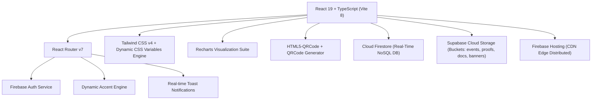
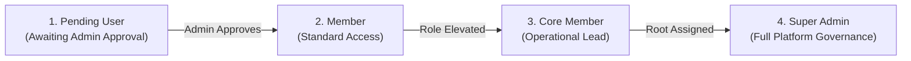
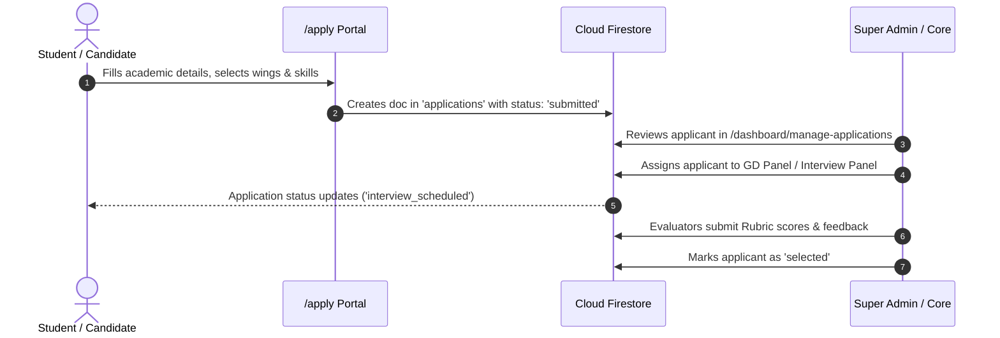
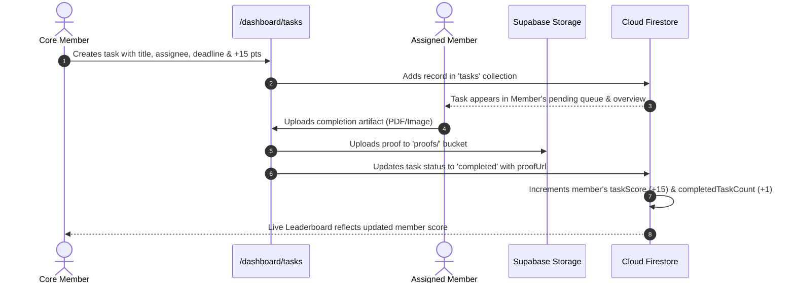
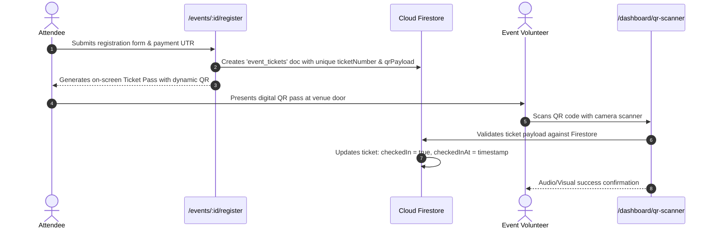

# SAInT — Student Association of Information Technology
### Enterprise Club Management, Event Operations, Recruitment & Governance Platform

---

## 📖 Table of Contents
1. [Executive Overview](#-executive-overview)
2. [Technology Stack & Architectural Overview](#-technology-stack--architectural-overview)
3. [Role-Based Access Control (RBAC) & Permissions](#-role-based-access-control-rbac--permissions)
4. [Functional Modules & System Features](#-functional-modules--system-features)
   - [Public Web Portal](#1-public-web-portal)
   - [Authentication & Account Onboarding](#2-authentication--account-onboarding)
   - [General Member Dashboard](#3-general-member-dashboard)
   - [Core Member Operations](#4-core-member-operations)
   - [Executive Governance & Super Admin Console](#5-executive-governance--super-admin-console)
5. [Operational Workflows ("What Happens When You...")](#-operational-workflows-what-happens-when-you)
6. [Data Architecture & Firestore Schema](#-data-architecture--firestore-schema)
7. [Cloud Storage Architecture (Supabase Buckets)](#-cloud-storage-architecture-supabase-buckets)
8. [UI/UX & Dynamic Theming Engine](#-uiux--dynamic-theming-engine)
9. [Installation, Development & Deployment Guide](#-installation-development--deployment-guide)

---

## 🌟 Executive Overview

**SAInT (Student Association of Information Technology)** is a centralized, real-time enterprise management system engineered for collegiate departmental bodies. It streamlines student community governance, recruitment pipelines, event registration, custom dynamic form generation, QR-based ticketing and attendance verification, task-driven point economies, financial auditing, document archival, and administrative access delegation.

### Core Value Propositions
- **Unified Ecosystem**: Replaces fragmented spreadsheets, chat groups, and form builders with a single integrated portal.
- **End-to-End Recruitment Engine**: Covers public student applications, multi-round screening, Group Discussion (GD) scoring with custom rubrics, interview panel allocations, and auto-onboarding.
- **Event Logistics & Ticketing**: Supports ticket generation, payment verification, custom form builder fields, physical lab/classroom space allocations, attendee check-in via camera QR scanning, and winner archiving.
- **Gamified Member Engagement**: Core members assign tasks with strict deadlines, priorities, and point values; members submit digital proof for verification and climb the real-time leaderboard.
- **High-Security Financial & Administrative Audit**: Double-entry financial expense tracking with receipt upload, role elevation gates, granular sidebar permissions, and immutable administrative activity telemetry.

---

## 🛠 Technology Stack & Architectural Overview



| Layer | Technology | Purpose & Capabilities |
| :--- | :--- | :--- |
| **Frontend Framework** | React 19 (`react`, `react-dom`) | Component architecture with concurrent rendering and hooks. |
| **Language & Tooling** | TypeScript 5.8+ & Vite 8 | Strict type checking, fast HMR, optimized tree-shaking production bundling. |
| **Styling & Design System** | Tailwind CSS v4 + Vanilla CSS Variables | Micro-rounded geometry (`rounded-[6px]`), high-contrast dark palette, zero layout shift. |
| **Database & Auth** | Google Cloud Firestore & Firebase Auth | Real-time reactive data listeners (`onSnapshot`), OAuth + Password authentication. |
| **Cloud Object Storage** | Supabase Storage (`@supabase/supabase-js`) | High-capacity binary file storage for banners, receipts, PDFs, and proof submissions. |
| **Data Visualization** | Recharts | Live responsive SVG/Canvas charts for leaderboards, financials, and attendance metrics. |
| **QR & Scanning Engine** | `html5-qrcode` & `qrcode` | Real-time hardware camera decoding and cryptographic QR pass generation. |
| **Icons & Typography** | `lucide-react` & Inter (Google Fonts) | Editorial iconography and clean typography. |

---

## 🔐 Role-Based Access Control (RBAC) & Permissions

SAInT enforces a 4-tier hierarchical access model. Every user account holds a distinct status (`pending`, `approved`, `rejected`) and a specific role:



### Granular Permission Matrix

The application allows Super Admins to dynamically grant or revoke specific sidebar tabs for any user via **Access Control** (`/dashboard/access-control`), overriding defaults:

| Sidebar Module / Route | Pending | Member | Core Member | Super Admin | Description |
| :--- | :---: | :---: | :---: | :---: | :--- |
| **Dashboard Home** (`/dashboard`) | ❌ | ✅ | ✅ | ✅ | Personal stats, upcoming events, pending tasks, score overview. |
| **Events** (`/dashboard/events`) | ❌ | ✅ (View/Register) | ✅ (Create/Edit) | ✅ (Full CRUD) | Event catalog, banner management, ticket builder. |
| **Event Details** (`/dashboard/events/:id`) | ❌ | ✅ (Register) | ✅ (Manage Logistics) | ✅ (Full Access) | Space allocation, registrant lists, QR check-in, winners. |
| **Calendar** (`/dashboard/calendar`) | ❌ | ✅ | ✅ | ✅ | Month & day timeline of events and club milestones. |
| **Agenda & Meetings** (`/dashboard/agenda`) | ❌ | ✅ (View) | ✅ (Create/Minutes) | ✅ (Full Control) | Meeting agenda planner, Google Meet integration. |
| **Tasks & Leaderboard** (`/dashboard/tasks`) | ❌ | ✅ (Submit Proof) | ✅ (Assign/Review) | ✅ (Full Control) | Member tasks, points allocation, verification proof. |
| **Explore & Directory** (`/dashboard/explore`) | ❌ | ✅ | ✅ | ✅ | Searchable member directory, follow network, profiles. |
| **QR Scanner** (`/dashboard/qr-scanner`) | ❌ | ✅ | ✅ | ✅ | Camera-based event check-in scanner. |
| **Profile & Appearance** (`/dashboard/profile`) | ❌ | ✅ | ✅ | ✅ | Account settings, bio, real-time UI theme color picker. |
| **Analytics & Intelligence** (`/dashboard/analytics`) | ❌ | ❌ | ✅ | ✅ | Live club metrics, leaderboard charts, task breakdown. |
| **Teams & Wings** (`/dashboard/teams`) | ❌ | ❌ | ✅ | ✅ | Technical, Media, Management, Decoration, Documentation wings. |
| **Files & Cloud Storage** (`/dashboard/files`) | ❌ | ❌ | ✅ | ✅ | Personal Supabase storage manager, quotas, upload drawer. |
| **Documentation Vault** (`/dashboard/documentation`) | ❌ | ❌ | ✅ | ✅ | Official SOPs, activity reports, circulars, template archive. |
| **Manage Applications** (`/dashboard/manage-applications`) | ❌ | ❌ | ✅ | ✅ | Review incoming applicants, filter by domain, assign to panels. |
| **Interview Panels** (`/dashboard/interview-panels`) | ❌ | ❌ | ✅ | ✅ | Create interview panels, assign panellists, evaluate candidates. |
| **GD Panels & Rubrics** (`/dashboard/gd-panels`) | ❌ | ❌ | ✅ | ✅ | Group Discussion rooms, criteria scoring, rubric evaluators. |
| **Control Centre** (`/dashboard/control-centre`) | ❌ | ❌ | ❌ | ✅ | Global website settings, toggle `/apply` gateway, WhatsApp link. |
| **User Approvals** (`/dashboard/user-approvals`) | ❌ | ❌ | ❌ | ✅ | Approve/Reject new signups, assign roles, assign positions. |
| **Positions & Hierarchy** (`/dashboard/positions`) | ❌ | ❌ | ❌ | ✅ | Executive structure (President, VP, Leads) & holder assignments. |
| **Access Control** (`/dashboard/access-control`) | ❌ | ❌ | ❌ | ✅ | Granular switchboard toggling per-user route permissions. |
| **Finance Ledger** (`/dashboard/finance`) | ❌ | ❌ | ❌ (Unless Granted) | ✅ | Double-entry expenditure, receipt proofs, sponsorship funds. |
| **Financial Analytics** (`/dashboard/financial-analytics`) | ❌ | ❌ | ❌ (Unless Granted) | ✅ | Budget vs Spend analysis, expense categorization charts. |
| **Audit & Activity Logs** (`/dashboard/user-activity`) | ❌ | ❌ | ❌ | ✅ | Real-time audit log of logins, deletions, role updates. |
| **Home Images & Banners** (`/dashboard/home-images`) | ❌ | ❌ | ❌ | ✅ | Public website carousel images and banner management. |

---

## 💻 Functional Modules & System Features

### 1. Public Web Portal
The public-facing area provides visibility into SAInT activities for prospective students, faculty, and guests.

* **Homepage (`/`)**: Hero section, club statistics counter, interactive showcases, upcoming featured event cards, and faculty advisor messages.
* **Activities & Past Events (`/activities`)**: Filterable timeline of past workshops, hackathons, seminars, and technical competitions.
* **About & Governance (`/about`)**: Organizational structure, faculty advisory board, core team leadership showcase, and department alignment.
* **Public Event Registration (`/events/:eventId/register`)**:
  - Dynamically renders custom form fields defined by event organizers (e.g., GitHub URL, dietary preference, team size).
  - Displays integrated Payment QR for paid workshops and collects transaction UTR IDs.
  - Automatically issues a downloadable digital pass with a cryptographic QR code.
* **Recruitment & Membership Application (`/apply`)**:
  - Available when public applications are enabled in the Control Centre.
  - Collects candidate academic details (RBT ID, Branch, Year, Phone, Email), wing preferences (Social Media, Management, Media, Decoration, Documentation), skill questionnaires, and personal statements.

---

### 2. Authentication & Account Onboarding
* **Multi-Provider Auth (`/login`)**: Supports Google OAuth and Email/Password sign-in.
* **Profile Setup (`/profile-setup`)**: New users complete mandatory profile metadata (First Name, Last Name, Phone, Academic Batch Year, Bio).
* **Pending Approval Gate (`/pending-approval`)**: Once registered, unverified users are held in a pending state with real-time Firestore listeners. As soon as a Super Admin approves the user in the admin console, their screen updates instantly to redirect into the dashboard.

---

### 3. General Member Dashboard

#### 3.1 Overview (`/dashboard`)
* **Live System Time & Greeting**: Role-aware personalized welcome banner.
* **KPI Metrics**: Personal task score, completed task counter, pending deliverables count, and upcoming events count.
* **Upcoming Events & Meeting Quicklinks**: Fast access to active event details and virtual meeting links.

#### 3.2 Dynamic UI Theme & Accent Engine (`/dashboard/profile`)
* **8 Curated Accent Palettes**: Royal Purple (`#7c3aed`), Electric Indigo (`#6366f1`), Cyber Blue (`#2563eb`), Sky Cyan (`#0284c7`), Emerald Green (`#10b981`), Crimson Red (`#ef4444`), Sunset Amber (`#f59e0b`), Vibrant Rose (`#ec4899`).
* **Custom HTML5 Color Picker**: Allows members and admins to select any hex color.
* **Reactive DOM Engine**: Updates CSS variables `--dash-accent`, `--dash-accent-soft`, `--dash-active`, `--blue-500`, and `--blue-600` across the entire application instantly without reloading.
* **Local Persistence**: Saves theme choices to `localStorage` (`saint-accent-color`).

#### 3.3 Task Execution & Proof Submissions (`/dashboard/tasks`)
* **Task Catalog**: Filter by Pending, Completed, or Priority (Urgent, High, Medium, Low).
* **View Modes**: Toggle between dense Grid view and structured List view.
* **Proof Submissions**: Members open assigned tasks, attach document proofs (PDF, images, archives), and trigger auto-completion with score points credited to their profile upon verification.

#### 3.4 Event Attendance & QR Scanner (`/dashboard/qr-scanner`)
* Hardware camera scanner that decodes attendee tickets at the venue entrance.
* Instantly marks attendees as `checkedIn: true` in Firestore with check-in timestamp and operator signature.

#### 3.5 Networking & Directory (`/dashboard/explore`)
* Searchable directory of verified members, core members, and executive leads.
* Social connection engine with **Follow** / **Unfollow** capabilities and dedicated Followers/Following tabs.

---

### 4. Core Member Operations

#### 4.1 Event Management & Form Builder (`/dashboard/events`)
* **Event Creation**: Set title, description, dates, times, venue, location, budget, and Supabase banner uploads.
* **Custom Form Builder**: Add dynamic registration input fields (text, number, email, select dropdowns, textareas) with mandatory/optional rules.
* **Domain Selection**: Configure specialized participant tracks (e.g., Web Dev, AI/ML, UI/UX).
* **Space Capacity & Allocations**: Define lab/classroom venue spaces and auto-allocate or manually assign registered participants.
* **Winner Podiums**: Publish official 1st, 2nd, and 3rd rank podium finishers with cash prizes and certificates.

#### 4.2 Task Assignment & Delegation (`/dashboard/tasks`)
* Core members assign targeted operational tasks to approved club members with point awards, custom deadlines, and priority tags.
* Core members can inspect submitted proof files, update deadlines, or unassign/delete tasks.

#### 4.3 Meeting Agendas & Minutes (`/dashboard/agenda`)
* Schedule upcoming general body or core meetings with ordered agenda items, duration estimates, and Google Meet/Zoom URLs.
* Archive official meeting minutes for transparency.

#### 4.4 Document Vault & Knowledge Base (`/dashboard/documentation`)
* Repository organized by **Academic Year** (`2026-2027`, `2025-2026`, `2024-2025`, etc.) and **Category** (*Guidebooks & SOPs*, *Activity Reports*, *Templates*, *Circulars*, *Minutes*).
* Direct file streaming from Supabase Storage with download counters and edit drawers.

---

### 5. Executive Governance & Super Admin Console

#### 5.1 Control Centre (`/dashboard/control-centre`)
* **Public Gateway Switch**: Enable or disable candidate registrations on `/apply` with instant warning banners on the live site.
* **Club Metadata Configuration**: Edit live hero descriptions, about text, and candidate WhatsApp community redirect links.

#### 5.2 User Approvals & Role Hierarchy (`/dashboard/user-approvals`)
* **Onboarding Gate**: Review pending registrations with candidate details.
* **Role Delegation**: Assign or switch roles (`member`, `core`, `superadmin`).
* **Position Assignment**: Link members to formal titles (President, Secretary, Technical Lead).
* **Account Revocation**: Reject or revoke access with immediate security rule lockdown.

#### 5.3 Access Control Switchboard (`/dashboard/access-control`)
* Granular matrix providing per-user toggle switches for all 23 platform routes and modules.
* Grants or revokes sensitive modules (such as the Finance ledger or Interview panels) to individual core members on a need-to-know basis.

#### 5.4 Recruitment, GD & Interview Operations
* **Application Management (`/dashboard/manage-applications`)**: Filter incoming applicants by wing/skills, assign them to interview panels, change candidate statuses, and export data.
* **Interview Panels (`/dashboard/interview-panels`)**: Create interview rooms, assign panellist members, record live scores, ratings, and qualitative candidate feedback.
* **Group Discussion Panels & Rubrics (`/dashboard/gd-panels`)**: Define structured grading rubrics (e.g., Communication, Technical Depth, Leadership), score candidates across criteria, compute weighted percentages, and finalize shortlisted batches.

#### 5.5 Financial Ledger & Analytics (`/dashboard/finance` & `/dashboard/financial-analytics`)
* Double-entry bookkeeping tracking association revenue, ticket sales, sponsorship receipts, and expenditure items.
* Mandatory receipt upload backed by Supabase Storage.
* Visual analytics displaying spending velocity, expense categories, event-wise budget utilization, and net cash balance.

#### 5.6 Audit & Activity Logs (`/dashboard/user-activity`)
* Immutable chronological event stream tracking administrative interventions (role alterations, task deletions, status overrides, and security modifications).

---

## ⚡ Operational Workflows ("What Happens When You...")

### Workflow A: A Student Applies for Club Recruitment


---

### Workflow B: Task Lifecycle & Point Economy


---

### Workflow C: Event Ticket Issuance & Live QR Check-in


---

## 🗄 Data Architecture & Firestore Schema

SAInT organizes its persistent state across standardized Firestore collections:

| Collection Name | Primary Purpose | Key Fields & Data Structure |
| :--- | :--- | :--- |
| `users` | User accounts, roles, scores, permissions | `uid`, `email`, `displayName`, `role`, `status`, `permissions` (map), `taskScore`, `completedTaskCount`, `following`, `followers`, `teamIds`, `hasFinanceAccess` |
| `events` | Event schedules, budgets, form fields | `title`, `description`, `date`, `startTime`, `endTime`, `venue`, `status`, `participantIds`, `customFields`, `spaces`, `winners`, `imageURL` |
| `event_tickets` | Issued attendee passes & check-in state | `ticketNumber`, `eventId`, `guestName`, `guestEmail`, `qrPayload`, `checkedIn`, `checkedInAt`, `customResponses` |
| `tasks` | Assigned operational deliverables | `title`, `description`, `assigneeId`, `assignedBy`, `deadline`, `priority`, `status`, `points`, `proofDataUrl`, `proofFileName` |
| `applications` | Recruitment candidate submissions | `rbtNumber`, `firstName`, `lastName`, `department`, `sections`, `sectionSkills`, `phone`, `email`, `status`, `panelId`, `gdPanelId`, `gdScore` |
| `meetings` | Scheduled meetings and agendas | `title`, `date`, `time`, `link`, `agenda` (array of items with title, duration, order), `createdBy`, `isPast` |
| `teams` | Functional departmental wings | `name`, `description`, `memberIds`, `pastMemberIds`, `createdBy` |
| `positions` | Hierarchy titles (e.g., President, VP) | `title`, `description`, `holderIds`, `order` |
| `documents` | Official archived files and SOPs | `title`, `description`, `fileName`, `fileType`, `fileSize`, `fileUrl`, `academicYear`, `category`, `eventId`, `uploadedBy` |
| `finances` | Income and expenditure ledger | `shopName`, `purpose`, `amount`, `transactionId`, `eventId`, `billDataUrl`, `isSponsorship`, `enteredBy` |
| `interview_panels` | Interview panels & evaluator rosters | `name`, `sections`, `interviewerIds`, `interviewerNames` |
| `gd_panels` | Group Discussion rooms & allocations | `name`, `venue`, `timeSlot`, `interviewerIds`, `interviewerNames` |
| `gd_rubrics` | Evaluation criteria & maximum marks | `title`, `description`, `maxMarks`, `category` |
| `student_rubric_evaluations` | Candidate scores by rubric | `applicationId`, `panelId`, `evaluatorId`, `rubricScores`, `totalScore`, `percentage` |
| `activity_logs` | Immutable audit telemetry log | `userId`, `userName`, `userEmail`, `action`, `details`, `timestamp` |
| `settings` | Global platform parameters | `applicationsOpen`, `clubDescription`, `aboutText`, `whatsappGroupLink` |

---

## ☁ Cloud Storage Architecture (Supabase Buckets)

All binary files and large documents are stored in cloud object storage via Supabase Storage:

```
saint-storage-root/
├── events/       # Event banner graphics and promotional posters
├── proofs/       # Member task completion files, screenshots, archives
├── documents/    # Official PDF guidebooks, circulars, meeting minutes
├── avatars/      # User profile photos and executive headshots
└── bills/        # Expenditure receipts, cash vouchers, sponsorship letters
```

* **Inline Fallback Engine**: If cloud upload is temporarily unavailable, small files (≤ 500 KB) are automatically handled via base64 data strings with zero user disruption.

---

## 🎨 UI/UX & Dynamic Theming Engine

SAInT employs an editorial design system built on high contrast, strict geometry, and responsive typography:

### Design Principles
1. **Crisp Geometry**: All cards, modal drawers, and input fields utilize square and micro-rounded geometry (`border-radius: 4px` to `6px`), avoiding bubbly or pill-shaped designs.
2. **High-Contrast Dark Canvas**: Default dark mode uses `#0d1117` and `#161b22` (GitHub charcoal styling) for crisp readability and low eye strain.
3. **Super Admin Identity**: Automatically shifts to a deep purple/indigo canvas (`#07070f` / `#0f0f1e` with `#7c3aed` accents) and displays a clean text-based `SA` badge instead of the public logo.
4. **Micro-Interactions**: Hover borders, subtle active glow fills, and smooth tab indicators.

---

## 🚀 Installation, Development & Deployment Guide

### Prerequisites
- **Node.js**: v18.0.0 or higher
- **npm**: v9.0.0 or higher
- **Firebase CLI**: `npm install -g firebase-tools` (or use `npx firebase-tools`)

---

### Step 1: Clone & Install Dependencies
```bash
git clone https://github.com/your-org/saint.git
cd saint
npm install
```

---

### Step 2: Configure Environment Variables
Create a `.env.local` file in the project root:

```env
# Firebase Configuration
VITE_FIREBASE_API_KEY="your-api-key"
VITE_FIREBASE_AUTH_DOMAIN="saintjspmrscoe.firebaseapp.com"
VITE_FIREBASE_PROJECT_ID="saintjspmrscoe"
VITE_FIREBASE_STORAGE_BUCKET="saintjspmrscoe.appspot.com"
VITE_FIREBASE_MESSAGING_SENDER_ID="your-sender-id"
VITE_FIREBASE_APP_ID="your-app-id"

# Super Admin Bootstrap (First account created with this email gets superadmin root)
VITE_SUPERADMIN_EMAIL="superadmin@saint.org"

# Supabase Storage Configuration
VITE_SUPABASE_URL="https://your-project.supabase.co"
VITE_SUPABASE_ANON_KEY="your-anon-key"
```

---

### Step 3: Run Local Development Server
```bash
npm run dev
```
The application will launch locally at `http://localhost:5173`.

---

### Step 4: Typecheck & Build for Production
```bash
npm run build
```
This runs `tsc -b` to guarantee zero type errors, followed by Vite bundling the optimized client assets into the `dist/` directory.

---

### Step 5: Deploy to Firebase Hosting
```bash
npx -y firebase-tools@latest deploy --only hosting
```

---

## 📄 License & Attribution
Developed for the **Student Association of Information Technology (SAInT)**.  
All rights reserved © 2026.
